# Cattle Management System - Context Diagram and DFD

**System name:** Cattle Management System  
**Organization:** SAWIT KINABALU FARM PRODUCTS SDN BHD  
**Technology scope:** Laravel 12, Vue 3, Inertia.js, MySQL or MariaDB  
**Source basis:** Current Laravel routes, controllers, models, migrations, and project documentation as of 2026-06-02.

## DFD Notation

| Symbol type | Format used in this document | Meaning |
|---|---|---|
| External entity | `E1 Admin` | Person or outside role that sends data to, or receives data from, the system |
| Process | `1.0 Authenticate and Authorize` | System function that transforms input data into output data |
| Data store | `D1 Users` | Persistent data table or grouped database tables |
| Data flow | Labeled arrow | Movement of data between an entity, process, or data store |

## Context Diagram - Level 0

The context diagram treats the whole application as one process. Data stores are not shown at this level because they are internal to the system.

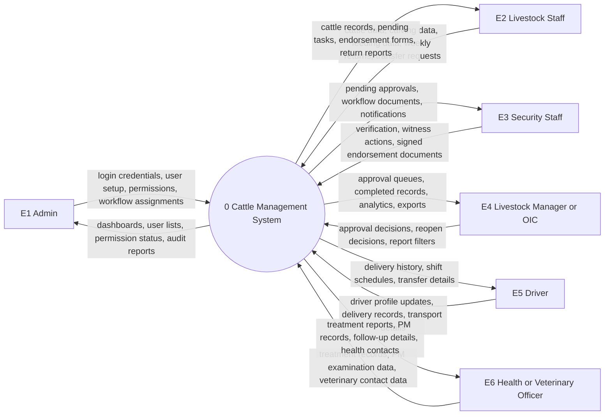
```mermaid
flowchart LR
    admin[E1 Admin]
    livestock[E2 Livestock Staff]
    security[E3 Security Staff]
    manager[E4 Livestock Manager or OIC]
    driver[E5 Driver]
    health[E6 Health or Veterinary Officer]

    system((0 Cattle Management System))

    admin -->|login credentials, user setup, permissions, workflow assignments| system
    system -->|dashboards, user lists, permission status, audit reports| admin

    livestock -->|cattle data, calving data, feeding data, weekly returns, transfer requests| system
    system -->|cattle records, pending tasks, endorsement forms, return reports| livestock

    security -->|verification, witness actions, signed endorsement documents| system
    system -->|pending approvals, workflow documents, notifications| security

    manager -->|approval decisions, reopen decisions, report filters| system
    system -->|approval queues, completed records, analytics, exports| manager

    driver -->|driver profile updates, delivery records, transport details| system
    system -->|delivery history, shift schedules, transfer details| driver

    health -->|treatment records, PM examination data, veterinary contact data| system
    system -->|treatment reports, PM records, follow-up details, health contacts| health
```

### Context Diagram Data Flows

| Flow ID | Source | Destination | Data flow |
|---|---|---|---|
| F0.1 | Admin | System | Login credentials, users, roles, module permissions, field permissions, workflow assignments |
| F0.2 | System | Admin | Dashboard summary, access matrix, audit logs, user status |
| F0.3 | Livestock Staff | System | Cattle directory data, calving records, daily operation entries, weekly return filters, transfer data, feeding data |
| F0.4 | System | Livestock Staff | Cattle profiles, cattle reports, endorsement forms, workflow notifications |
| F0.5 | Security Staff | System | Verification decisions, witness decisions, signed documents |
| F0.6 | System | Security Staff | Pending verification or witness tasks, related documents |
| F0.7 | Livestock Manager or OIC | System | Approval, rejection, reopen, and completion decisions |
| F0.8 | System | Livestock Manager or OIC | Approval queues, completed records, performance summaries, exports |
| F0.9 | Driver | System | Driver details, delivery history, vehicle and transport information |
| F0.10 | System | Driver | Shift schedule, delivery records, transfer instructions |
| F0.11 | Health or Veterinary Officer | System | Treatment details, PM examination details, veterinary contact details |
| F0.12 | System | Health or Veterinary Officer | Treatment records, follow-up data, health reports |

## DFD Level 1 - System Decomposition

Level 1 decomposes Process 0 into the main system processes and shows their primary data stores.

```mermaid
flowchart LR
    admin[E1 Admin]
    livestock[E2 Livestock Staff]
    security[E3 Security Staff]
    manager[E4 Livestock Manager or OIC]
    driver[E5 Driver]
    health[E6 Health or Veterinary Officer]

    subgraph systemBoundary[0 Cattle Management System]
        p1((1.0 Authenticate and Authorize))
        p2((2.0 Manage Cattle Directory))
        p3((3.0 Manage Cattle Operations and Returns))
        p4((4.0 Manage Calving and Checklist))
        p5((5.0 Manage Mortality and PM Examination))
        p6((6.0 Manage Health and Treatment))
        p7((7.0 Manage Transfer Documents))
        p8((8.0 Manage Pasture Grazing and Herd Cards))
        p9((9.0 Manage Feeding))
        p10((10.0 Manage Inventory and Suppliers))
        p11((11.0 Manage Driver and Delivery))
        p12((12.0 Manage Tasks Reporting and Audit))

        d1[(D1 Users)]
        d2[(D2 Permissions and Workflow Assignments)]
        d3[(D3 Cattle Directory)]
        d4[(D4 Cattle Operations)]
        d5[(D5 Calving Records)]
        d6[(D6 Mortality Records)]
        d7[(D7 Health Treatment Records)]
        d8[(D8 Transfer Records)]
        d9[(D9 Pasture and Grazing Records)]
        d10[(D10 Feeding Records)]
        d11[(D11 Inventory and Supplier Records)]
        d12[(D12 Driver and Delivery Records)]
        d13[(D13 Task and Notification Records)]
        d14[(D14 File and Document Storage)]
        d15[(D15 Audit Logs)]
    end

    admin -->|credentials and access setup| p1
    livestock -->|operational livestock data| p2
    livestock -->|daily and weekly return data| p3
    livestock -->|birth and checklist data| p4
    livestock -->|mortality report data| p5
    health -->|treatment and PM data| p5
    health -->|treatment and contact data| p6
    livestock -->|movement and transfer data| p7
    security -->|workflow verification and witness actions| p4
    security -->|workflow verification and witness actions| p5
    security -->|transfer witness and verification actions| p7
    manager -->|approval and completion decisions| p4
    manager -->|approval and completion decisions| p5
    manager -->|approval and completion decisions| p6
    manager -->|approval and completion decisions| p7
    driver -->|delivery and transport data| p11

    p1 <-->|user account data| d1
    p1 <-->|permission rules and assignments| d2
    p1 -->|access events| d15

    p2 <-->|cattle profiles and custom fields| d3
    p2 <-->|profile images and exports| d14
    p2 -->|record changes| d15

    p3 <-->|weekly return and daily operation data| d4
    p3 <-->|cattle source data| d3
    p3 <-->|calving source data| d5
    p3 <-->|mortality source data| d6
    p3 <-->|transfer source data| d8
    p3 <-->|workflow files| d14

    p4 <-->|calving and checklist records| d5
    p4 <-->|linked cattle data| d3
    p4 <-->|endorsement files and LCC documents| d14
    p4 -->|workflow notices| d13

    p5 <-->|mortality cases approvals and PM records| d6
    p5 <-->|linked cattle data| d3
    p5 <-->|endorsement files and PM documents| d14
    p5 -->|workflow notices| d13

    p6 <-->|treatments codes workflows and veterinary contacts| d7
    p6 <-->|linked cattle data| d3
    p6 <-->|medication stock data| d11
    p6 <-->|endorsement files and reports| d14
    p6 -->|workflow notices| d13

    p7 <-->|transfer documents livestock and approvals| d8
    p7 <-->|cattle location and status data| d3
    p7 <-->|driver details| d12
    p7 <-->|endorsement files and forms| d14
    p7 -->|workflow notices| d13

    p8 <-->|estates herds blocks phases and grazing details| d9
    p8 <-->|cattle location reference data| d3

    p9 <-->|feeding records and feed options| d10
    p9 <-->|feeding PDF export| d14

    p10 <-->|medications stocks histories and suppliers| d11

    p11 <-->|driver profiles and deliveries| d12
    p11 <-->|driver user account data| d1

    p12 <-->|tasks and notifications| d13
    p12 <-->|audit trail| d15
    p12 -->|reports and analytics output| admin
    p12 -->|reports and workflow notices| manager
    p12 -->|assigned tasks and notices| livestock
    p12 -->|assigned tasks and notices| security
    p12 -->|assigned tasks and notices| driver
```

### Level 1 Process Summary

| Process | Name | Main purpose | Main data stores |
|---|---|---|---|
| 1.0 | Authenticate and Authorize | Login, logout, profile access, module permission checks, access control matrix | D1, D2, D15 |
| 2.0 | Manage Cattle Directory | Register, update, view, delete, filter, and export cattle records | D3, D14, D15 |
| 3.0 | Manage Cattle Operations and Returns | Weekly cattle return, daily operation entry, workflow upload, completion, and export | D3, D4, D5, D6, D8, D14 |
| 4.0 | Manage Calving and Checklist | Calving records, LCC document, calving checklist, monthly checklist workflow | D3, D5, D13, D14 |
| 5.0 | Manage Mortality and PM Examination | Mortality cases, PM examination, approval workflow, endorsement documents | D3, D6, D13, D14 |
| 6.0 | Manage Health and Treatment | Treatment records, treatment codes, monthly treatment workflow, veterinary contacts | D3, D7, D11, D13, D14 |
| 7.0 | Manage Transfer Documents | CTV, Receival, SIV, livestock movement, approval workflow, endorsement forms | D3, D8, D12, D13, D14 |
| 8.0 | Manage Pasture Grazing and Herd Cards | Operating units, estates, herds, blocks, phases, grazing details, herd cards | D3, D9 |
| 9.0 | Manage Feeding | Feeding records, feeding schedule, feed options, feeding export | D10, D14 |
| 10.0 | Manage Inventory and Suppliers | Medication stock, stock history, supplier records, thresholds and safety stock | D11 |
| 11.0 | Manage Driver and Delivery | Driver profiles, shift schedule, delivery history | D1, D12 |
| 12.0 | Manage Tasks Reporting and Audit | Tasks, task notifications, dashboard, audit logs, performance analytics | D13, D15 and read-only reporting sources |

## DFD Level 2 - Detailed Process Decomposition

Level 2 decomposes each Level 1 process into sub-processes. The numbering follows the parent process number.

### Level 2 for Process 1.0 - Authenticate and Authorize

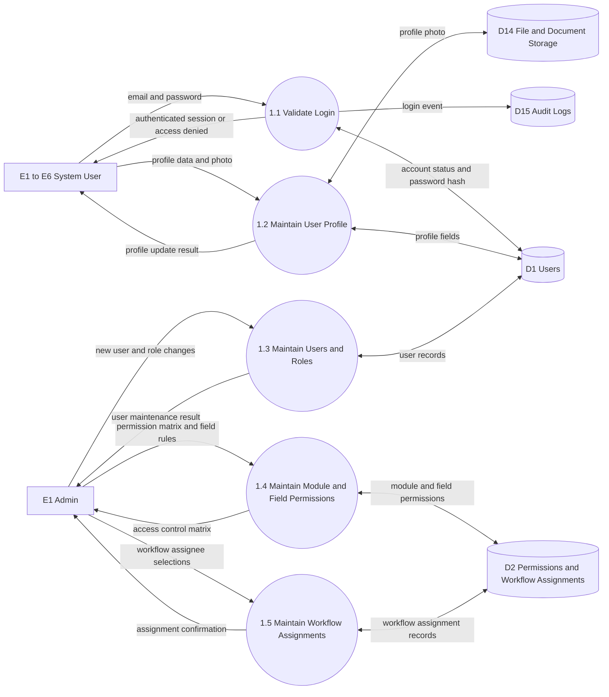
```mermaid
flowchart LR
    user[E1 to E6 System User]
    admin[E1 Admin]

    p11((1.1 Validate Login))
    p12((1.2 Maintain User Profile))
    p13((1.3 Maintain Users and Roles))
    p14((1.4 Maintain Module and Field Permissions))
    p15((1.5 Maintain Workflow Assignments))

    d1[(D1 Users)]
    d2[(D2 Permissions and Workflow Assignments)]
    d14[(D14 File and Document Storage)]
    d15[(D15 Audit Logs)]

    user -->|email and password| p11
    p11 <-->|account status and password hash| d1
    p11 -->|authenticated session or access denied| user
    p11 -->|login event| d15

    user -->|profile data and photo| p12
    p12 <-->|profile fields| d1
    p12 <-->|profile photo| d14
    p12 -->|profile update result| user

    admin -->|new user and role changes| p13
    p13 <-->|user records| d1
    p13 -->|user maintenance result| admin

    admin -->|permission matrix and field rules| p14
    p14 <-->|module and field permissions| d2
    p14 -->|access control matrix| admin

    admin -->|workflow assignee selections| p15
    p15 <-->|workflow assignment records| d2
    p15 -->|assignment confirmation| admin
```

### Level 2 for Process 2.0 - Manage Cattle Directory

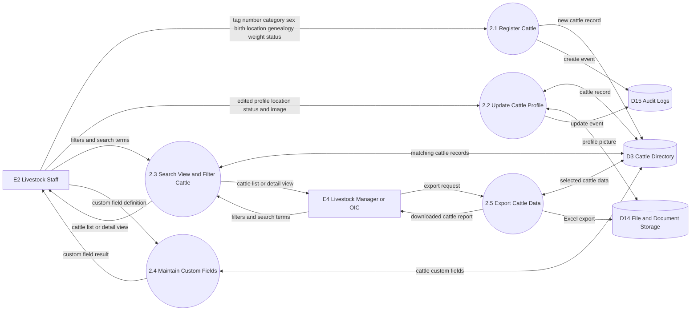
```mermaid
flowchart LR
    livestock[E2 Livestock Staff]
    manager[E4 Livestock Manager or OIC]

    p21((2.1 Register Cattle))
    p22((2.2 Update Cattle Profile))
    p23((2.3 Search View and Filter Cattle))
    p24((2.4 Maintain Custom Fields))
    p25((2.5 Export Cattle Data))

    d3[(D3 Cattle Directory)]
    d14[(D14 File and Document Storage)]
    d15[(D15 Audit Logs)]

    livestock -->|tag number category sex birth location genealogy weight status| p21
    p21 -->|new cattle record| d3
    p21 -->|create event| d15

    livestock -->|edited profile location status and image| p22
    p22 <-->|cattle record| d3
    p22 <-->|profile picture| d14
    p22 -->|update event| d15

    livestock -->|filters and search terms| p23
    manager -->|filters and search terms| p23
    p23 <-->|matching cattle records| d3
    p23 -->|cattle list or detail view| livestock
    p23 -->|cattle list or detail view| manager

    livestock -->|custom field definition| p24
    p24 <-->|cattle custom fields| d3
    p24 -->|custom field result| livestock

    manager -->|export request| p25
    p25 <-->|selected cattle data| d3
    p25 -->|Excel export| d14
    p25 -->|downloaded cattle report| manager
```

### Level 2 for Process 3.0 - Manage Cattle Operations and Returns

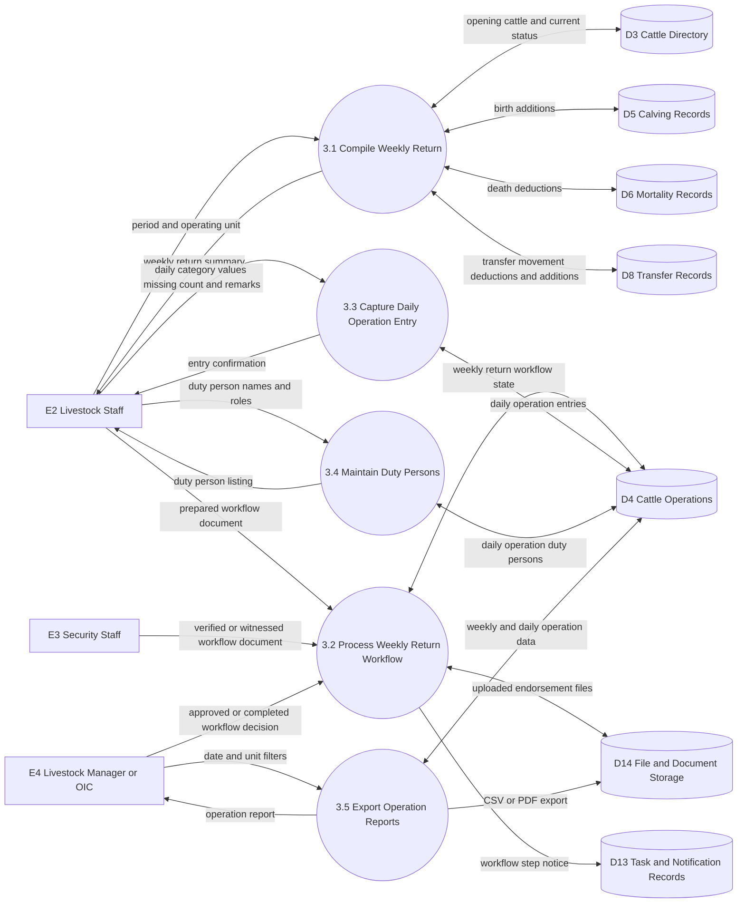
```mermaid
flowchart LR
    livestock[E2 Livestock Staff]
    security[E3 Security Staff]
    manager[E4 Livestock Manager or OIC]

    p31((3.1 Compile Weekly Return))
    p32((3.2 Process Weekly Return Workflow))
    p33((3.3 Capture Daily Operation Entry))
    p34((3.4 Maintain Duty Persons))
    p35((3.5 Export Operation Reports))

    d3[(D3 Cattle Directory)]
    d4[(D4 Cattle Operations)]
    d5[(D5 Calving Records)]
    d6[(D6 Mortality Records)]
    d8[(D8 Transfer Records)]
    d13[(D13 Task and Notification Records)]
    d14[(D14 File and Document Storage)]

    livestock -->|period and operating unit| p31
    p31 <-->|opening cattle and current status| d3
    p31 <-->|birth additions| d5
    p31 <-->|death deductions| d6
    p31 <-->|transfer movement deductions and additions| d8
    p31 -->|weekly return summary| livestock

    livestock -->|prepared workflow document| p32
    security -->|verified or witnessed workflow document| p32
    manager -->|approved or completed workflow decision| p32
    p32 <-->|weekly return workflow state| d4
    p32 <-->|uploaded endorsement files| d14
    p32 -->|workflow step notice| d13

    livestock -->|daily category values missing count and remarks| p33
    p33 <-->|daily operation entries| d4
    p33 -->|entry confirmation| livestock

    livestock -->|duty person names and roles| p34
    p34 <-->|daily operation duty persons| d4
    p34 -->|duty person listing| livestock

    manager -->|date and unit filters| p35
    p35 <-->|weekly and daily operation data| d4
    p35 -->|CSV or PDF export| d14
    p35 -->|operation report| manager
```

### Level 2 for Process 4.0 - Manage Calving and Checklist

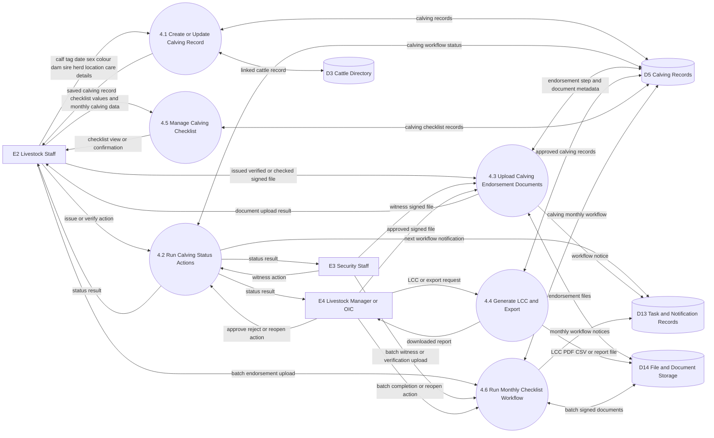
```mermaid
flowchart LR
    livestock[E2 Livestock Staff]
    security[E3 Security Staff]
    manager[E4 Livestock Manager or OIC]

    p41((4.1 Create or Update Calving Record))
    p42((4.2 Run Calving Status Actions))
    p43((4.3 Upload Calving Endorsement Documents))
    p44((4.4 Generate LCC and Export))
    p45((4.5 Manage Calving Checklist))
    p46((4.6 Run Monthly Checklist Workflow))

    d3[(D3 Cattle Directory)]
    d5[(D5 Calving Records)]
    d13[(D13 Task and Notification Records)]
    d14[(D14 File and Document Storage)]

    livestock -->|calf tag date sex colour dam sire herd location care details| p41
    p41 <-->|calving records| d5
    p41 <-->|linked cattle record| d3
    p41 -->|saved calving record| livestock

    livestock -->|issue or verify action| p42
    security -->|witness action| p42
    manager -->|approve reject or reopen action| p42
    p42 <-->|calving workflow status| d5
    p42 -->|next workflow notification| d13
    p42 -->|status result| livestock
    p42 -->|status result| security
    p42 -->|status result| manager

    livestock -->|issued verified or checked signed file| p43
    security -->|witness signed file| p43
    manager -->|approved signed file| p43
    p43 <-->|endorsement files| d14
    p43 <-->|endorsement step and document metadata| d5
    p43 -->|document upload result| livestock
    p43 -->|workflow notice| d13

    manager -->|LCC or export request| p44
    p44 <-->|approved calving records| d5
    p44 -->|LCC PDF CSV or report file| d14
    p44 -->|downloaded report| manager

    livestock -->|checklist values and monthly calving data| p45
    p45 <-->|calving checklist records| d5
    p45 -->|checklist view or confirmation| livestock

    livestock -->|batch endorsement upload| p46
    security -->|batch witness or verification upload| p46
    manager -->|batch completion or reopen action| p46
    p46 <-->|calving monthly workflow| d5
    p46 <-->|batch signed documents| d14
    p46 -->|monthly workflow notices| d13
```

### Level 2 for Process 5.0 - Manage Mortality and PM Examination

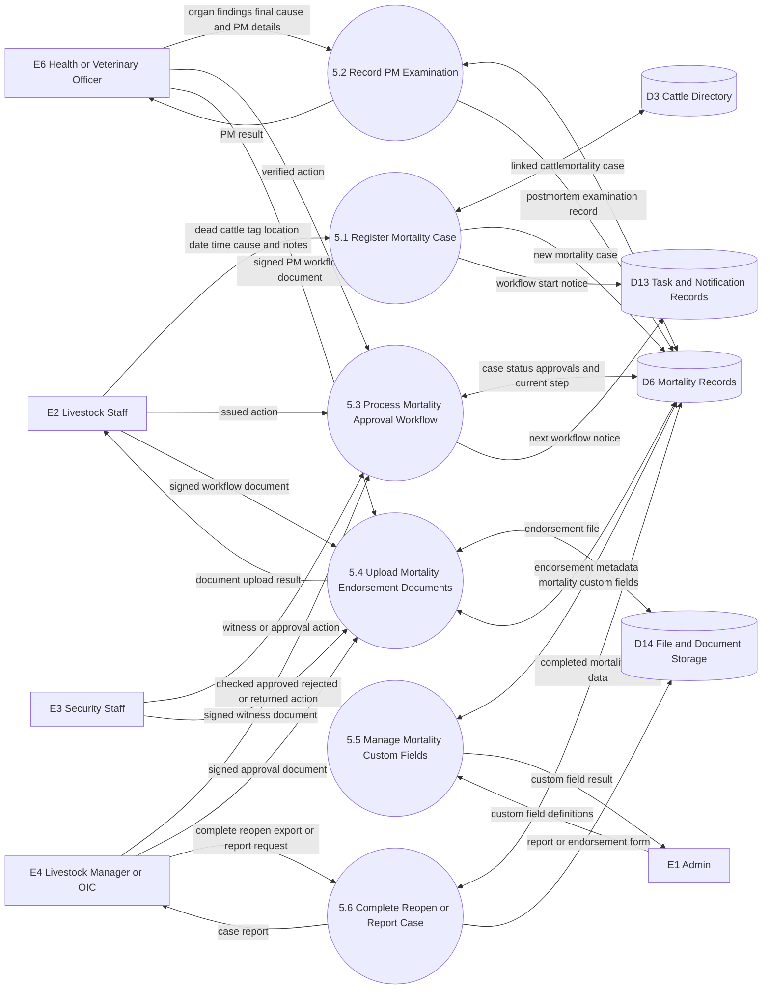
```mermaid
flowchart LR
    livestock[E2 Livestock Staff]
    health[E6 Health or Veterinary Officer]
    security[E3 Security Staff]
    manager[E4 Livestock Manager or OIC]

    p51((5.1 Register Mortality Case))
    p52((5.2 Record PM Examination))
    p53((5.3 Process Mortality Approval Workflow))
    p54((5.4 Upload Mortality Endorsement Documents))
    p55((5.5 Manage Mortality Custom Fields))
    p56((5.6 Complete Reopen or Report Case))

    d3[(D3 Cattle Directory)]
    d6[(D6 Mortality Records)]
    d13[(D13 Task and Notification Records)]
    d14[(D14 File and Document Storage)]

    livestock -->|dead cattle tag location date time cause and notes| p51
    p51 <-->|linked cattle profile| d3
    p51 -->|new mortality case| d6
    p51 -->|workflow start notice| d13

    health -->|organ findings final cause and PM details| p52
    p52 <-->|mortality case| d6
    p52 -->|postmortem examination record| d6
    p52 -->|PM result| health

    livestock -->|issued action| p53
    health -->|verified action| p53
    security -->|witness or approval action| p53
    manager -->|checked approved rejected or returned action| p53
    p53 <-->|case status approvals and current step| d6
    p53 -->|next workflow notice| d13

    livestock -->|signed workflow document| p54
    health -->|signed PM workflow document| p54
    security -->|signed witness document| p54
    manager -->|signed approval document| p54
    p54 <-->|endorsement file| d14
    p54 <-->|endorsement metadata| d6
    p54 -->|document upload result| livestock

    admin[E1 Admin] -->|custom field definitions| p55
    p55 <-->|mortality custom fields| d6
    p55 -->|custom field result| admin

    manager -->|complete reopen export or report request| p56
    p56 <-->|completed mortality case data| d6
    p56 -->|report or endorsement form| d14
    p56 -->|case report| manager
```

### Level 2 for Process 6.0 - Manage Health and Treatment

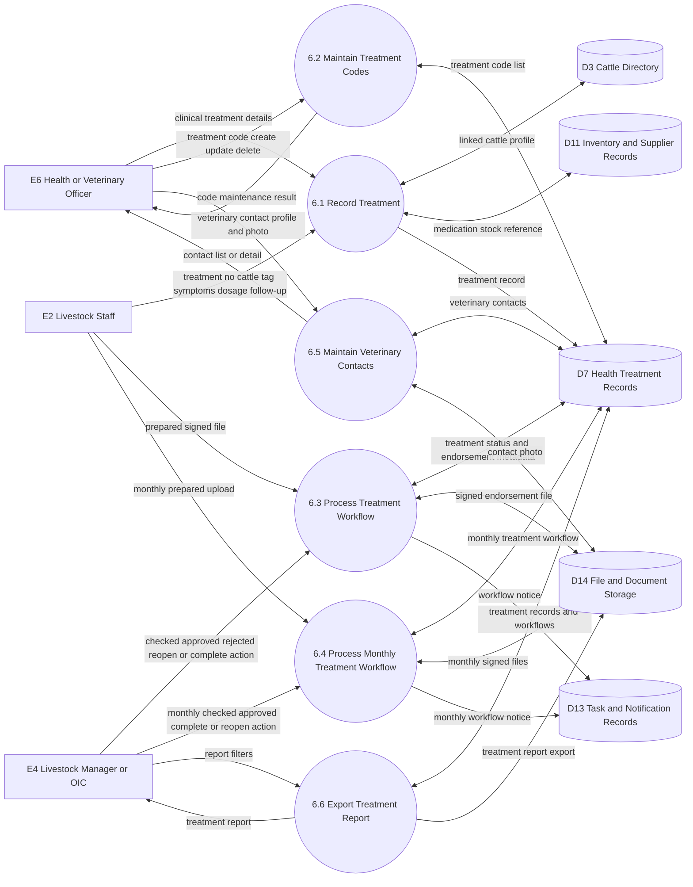
```mermaid
flowchart LR
    livestock[E2 Livestock Staff]
    health[E6 Health or Veterinary Officer]
    manager[E4 Livestock Manager or OIC]

    p61((6.1 Record Treatment))
    p62((6.2 Maintain Treatment Codes))
    p63((6.3 Process Treatment Workflow))
    p64((6.4 Process Monthly Treatment Workflow))
    p65((6.5 Maintain Veterinary Contacts))
    p66((6.6 Export Treatment Report))

    d3[(D3 Cattle Directory)]
    d7[(D7 Health Treatment Records)]
    d11[(D11 Inventory and Supplier Records)]
    d13[(D13 Task and Notification Records)]
    d14[(D14 File and Document Storage)]

    livestock -->|treatment no cattle tag symptoms dosage follow-up| p61
    health -->|clinical treatment details| p61
    p61 <-->|linked cattle profile| d3
    p61 <-->|medication stock reference| d11
    p61 -->|treatment record| d7

    health -->|treatment code create update delete| p62
    p62 <-->|treatment code list| d7
    p62 -->|code maintenance result| health

    livestock -->|prepared signed file| p63
    manager -->|checked approved rejected reopen or complete action| p63
    p63 <-->|treatment status and endorsement metadata| d7
    p63 <-->|signed endorsement file| d14
    p63 -->|workflow notice| d13

    livestock -->|monthly prepared upload| p64
    manager -->|monthly checked approved complete or reopen action| p64
    p64 <-->|monthly treatment workflow| d7
    p64 <-->|monthly signed files| d14
    p64 -->|monthly workflow notice| d13

    health -->|veterinary contact profile and photo| p65
    p65 <-->|veterinary contacts| d7
    p65 <-->|contact photo| d14
    p65 -->|contact list or detail| health

    manager -->|report filters| p66
    p66 <-->|treatment records and workflows| d7
    p66 -->|treatment report export| d14
    p66 -->|treatment report| manager
```

### Level 2 for Process 7.0 - Manage Transfer Documents

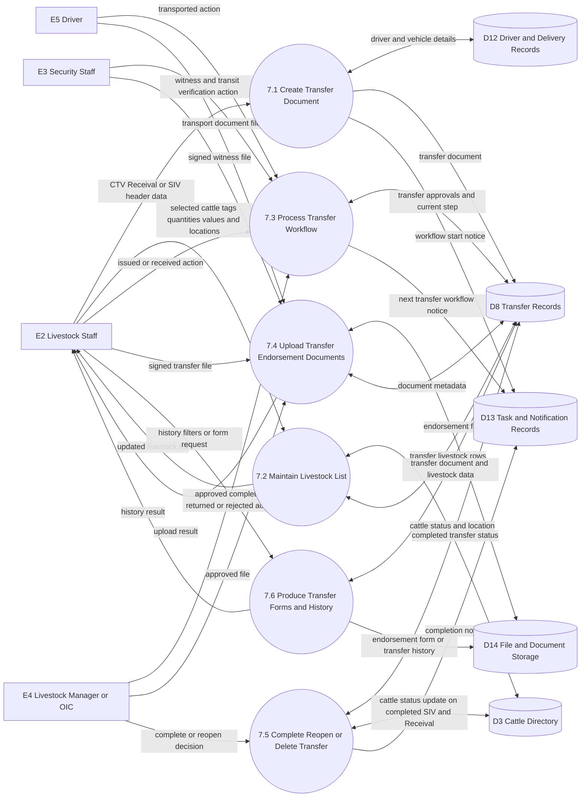
```mermaid
flowchart LR
    livestock[E2 Livestock Staff]
    security[E3 Security Staff]
    manager[E4 Livestock Manager or OIC]
    driver[E5 Driver]

    p71((7.1 Create Transfer Document))
    p72((7.2 Maintain Livestock List))
    p73((7.3 Process Transfer Workflow))
    p74((7.4 Upload Transfer Endorsement Documents))
    p75((7.5 Complete Reopen or Delete Transfer))
    p76((7.6 Produce Transfer Forms and History))

    d3[(D3 Cattle Directory)]
    d8[(D8 Transfer Records)]
    d12[(D12 Driver and Delivery Records)]
    d13[(D13 Task and Notification Records)]
    d14[(D14 File and Document Storage)]

    livestock -->|CTV Receival or SIV header data| p71
    p71 <-->|driver and vehicle details| d12
    p71 -->|transfer document| d8
    p71 -->|workflow start notice| d13

    livestock -->|selected cattle tags quantities values and locations| p72
    p72 <-->|cattle status and location| d3
    p72 <-->|transfer livestock rows| d8
    p72 -->|updated livestock list| livestock

    livestock -->|issued or received action| p73
    driver -->|transported action| p73
    security -->|witness and transit verification action| p73
    manager -->|approved completed returned or rejected action| p73
    p73 <-->|transfer approvals and current step| d8
    p73 -->|next transfer workflow notice| d13

    livestock -->|signed transfer file| p74
    driver -->|transport document file| p74
    security -->|signed witness file| p74
    manager -->|approved file| p74
    p74 <-->|endorsement files| d14
    p74 <-->|document metadata| d8
    p74 -->|upload result| livestock

    manager -->|complete or reopen decision| p75
    p75 <-->|completed transfer status| d8
    p75 <-->|cattle status update on completed SIV and Receival| d3
    p75 -->|completion notice| d13

    livestock -->|history filters or form request| p76
    p76 <-->|transfer document and livestock data| d8
    p76 -->|endorsement form or transfer history| d14
    p76 -->|history result| livestock
```

### Level 2 for Process 8.0 - Manage Pasture Grazing and Herd Cards

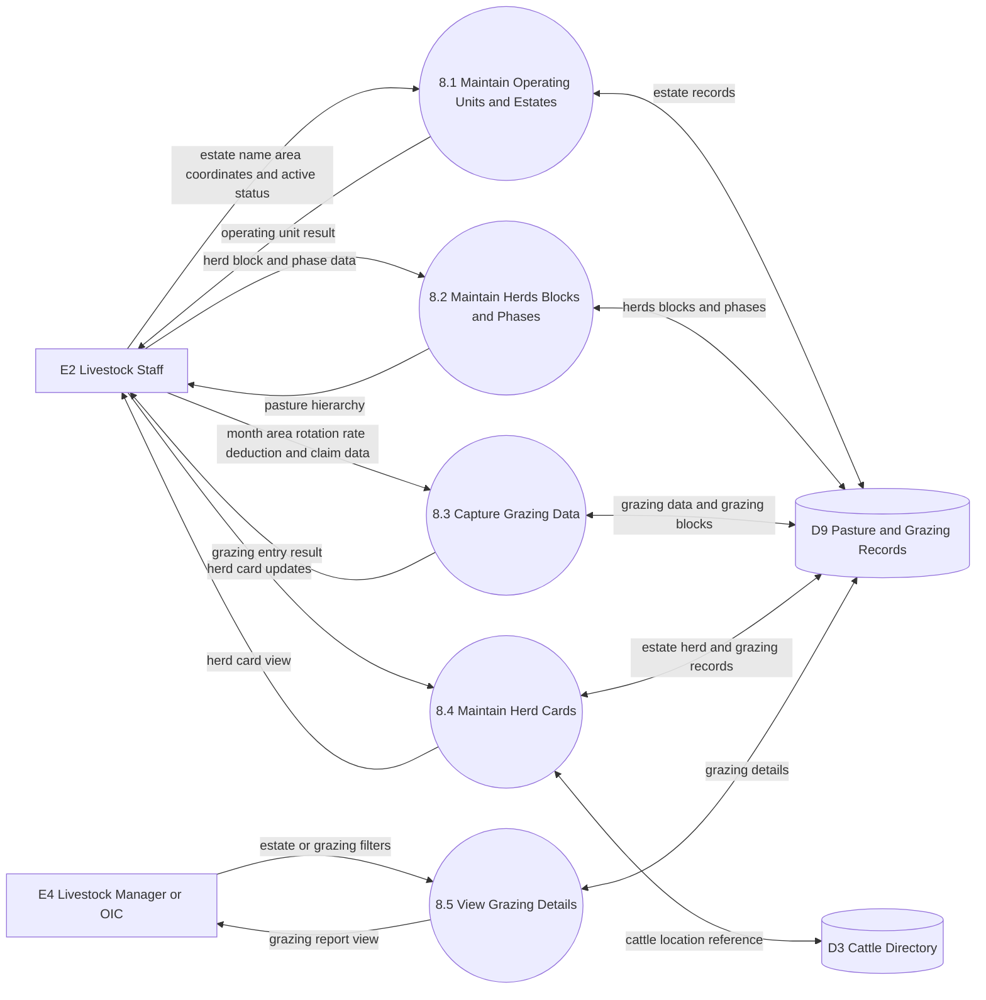
```mermaid
flowchart LR
    livestock[E2 Livestock Staff]
    manager[E4 Livestock Manager or OIC]

    p81((8.1 Maintain Operating Units and Estates))
    p82((8.2 Maintain Herds Blocks and Phases))
    p83((8.3 Capture Grazing Data))
    p84((8.4 Maintain Herd Cards))
    p85((8.5 View Grazing Details))

    d3[(D3 Cattle Directory)]
    d9[(D9 Pasture and Grazing Records)]

    livestock -->|estate name area coordinates and active status| p81
    p81 <-->|estate records| d9
    p81 -->|operating unit result| livestock

    livestock -->|herd block and phase data| p82
    p82 <-->|herds blocks and phases| d9
    p82 -->|pasture hierarchy| livestock

    livestock -->|month area rotation rate deduction and claim data| p83
    p83 <-->|grazing data and grazing blocks| d9
    p83 -->|grazing entry result| livestock

    livestock -->|herd card updates| p84
    p84 <-->|estate herd and grazing records| d9
    p84 <-->|cattle location reference| d3
    p84 -->|herd card view| livestock

    manager -->|estate or grazing filters| p85
    p85 <-->|grazing details| d9
    p85 -->|grazing report view| manager
```

### Level 2 for Process 9.0 - Manage Feeding

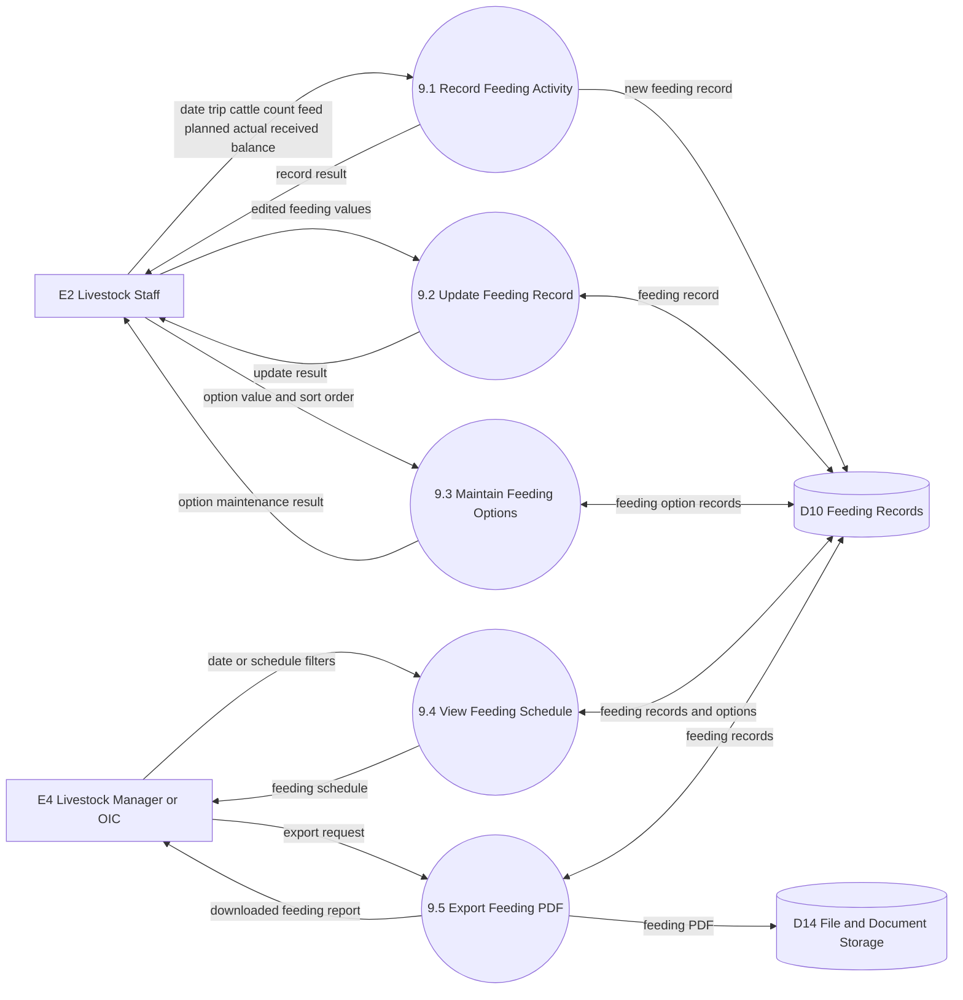
```mermaid
flowchart LR
    livestock[E2 Livestock Staff]
    manager[E4 Livestock Manager or OIC]

    p91((9.1 Record Feeding Activity))
    p92((9.2 Update Feeding Record))
    p93((9.3 Maintain Feeding Options))
    p94((9.4 View Feeding Schedule))
    p95((9.5 Export Feeding PDF))

    d10[(D10 Feeding Records)]
    d14[(D14 File and Document Storage)]

    livestock -->|date trip cattle count feed planned actual received balance| p91
    p91 -->|new feeding record| d10
    p91 -->|record result| livestock

    livestock -->|edited feeding values| p92
    p92 <-->|feeding record| d10
    p92 -->|update result| livestock

    livestock -->|option value and sort order| p93
    p93 <-->|feeding option records| d10
    p93 -->|option maintenance result| livestock

    manager -->|date or schedule filters| p94
    p94 <-->|feeding records and options| d10
    p94 -->|feeding schedule| manager

    manager -->|export request| p95
    p95 <-->|feeding records| d10
    p95 -->|feeding PDF| d14
    p95 -->|downloaded feeding report| manager
```

### Level 2 for Process 10.0 - Manage Inventory and Suppliers

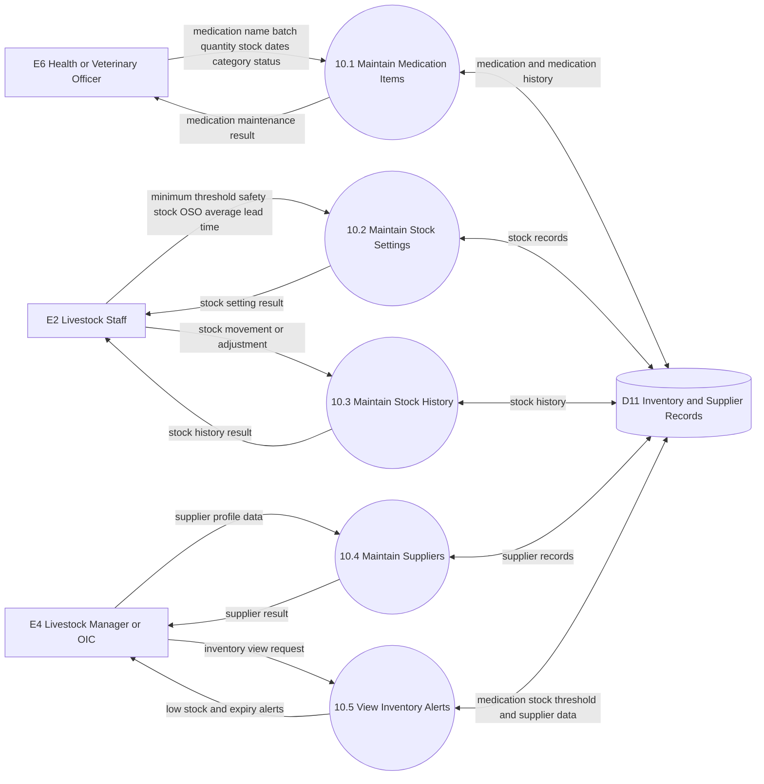
```mermaid
flowchart LR
    livestock[E2 Livestock Staff]
    health[E6 Health or Veterinary Officer]
    manager[E4 Livestock Manager or OIC]

    p101((10.1 Maintain Medication Items))
    p102((10.2 Maintain Stock Settings))
    p103((10.3 Maintain Stock History))
    p104((10.4 Maintain Suppliers))
    p105((10.5 View Inventory Alerts))

    d11[(D11 Inventory and Supplier Records)]

    health -->|medication name batch quantity stock dates category status| p101
    p101 <-->|medication and medication history| d11
    p101 -->|medication maintenance result| health

    livestock -->|minimum threshold safety stock OSO average lead time| p102
    p102 <-->|stock records| d11
    p102 -->|stock setting result| livestock

    livestock -->|stock movement or adjustment| p103
    p103 <-->|stock history| d11
    p103 -->|stock history result| livestock

    manager -->|supplier profile data| p104
    p104 <-->|supplier records| d11
    p104 -->|supplier result| manager

    manager -->|inventory view request| p105
    p105 <-->|medication stock threshold and supplier data| d11
    p105 -->|low stock and expiry alerts| manager
```

### Level 2 for Process 11.0 - Manage Driver and Delivery

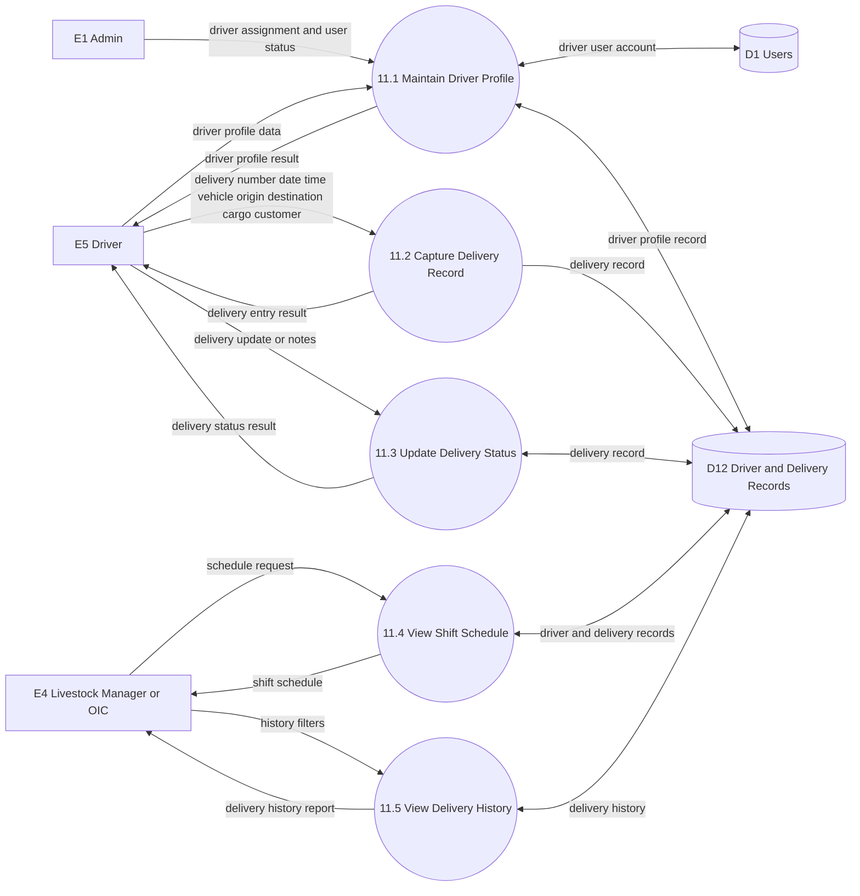
```mermaid
flowchart LR
    driver[E5 Driver]
    admin[E1 Admin]
    manager[E4 Livestock Manager or OIC]

    p111((11.1 Maintain Driver Profile))
    p112((11.2 Capture Delivery Record))
    p113((11.3 Update Delivery Status))
    p114((11.4 View Shift Schedule))
    p115((11.5 View Delivery History))

    d1[(D1 Users)]
    d12[(D12 Driver and Delivery Records)]

    admin -->|driver assignment and user status| p111
    driver -->|driver profile data| p111
    p111 <-->|driver user account| d1
    p111 <-->|driver profile record| d12
    p111 -->|driver profile result| driver

    driver -->|delivery number date time vehicle origin destination cargo customer| p112
    p112 -->|delivery record| d12
    p112 -->|delivery entry result| driver

    driver -->|delivery update or notes| p113
    p113 <-->|delivery record| d12
    p113 -->|delivery status result| driver

    manager -->|schedule request| p114
    p114 <-->|driver and delivery records| d12
    p114 -->|shift schedule| manager

    manager -->|history filters| p115
    p115 <-->|delivery history| d12
    p115 -->|delivery history report| manager
```

### Level 2 for Process 12.0 - Manage Tasks Reporting and Audit

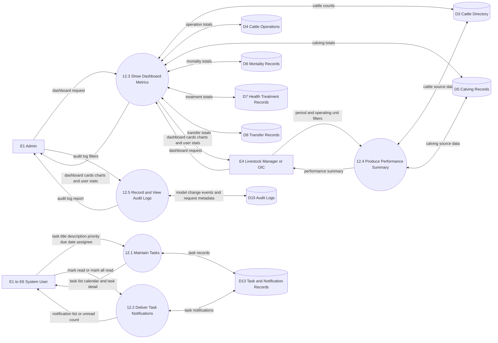
```mermaid
flowchart LR
    admin[E1 Admin]
    user[E1 to E6 System User]
    manager[E4 Livestock Manager or OIC]

    p121((12.1 Maintain Tasks))
    p122((12.2 Deliver Task Notifications))
    p123((12.3 Show Dashboard Metrics))
    p124((12.4 Produce Performance Summary))
    p125((12.5 Record and View Audit Logs))

    d3[(D3 Cattle Directory)]
    d4[(D4 Cattle Operations)]
    d5[(D5 Calving Records)]
    d6[(D6 Mortality Records)]
    d7[(D7 Health Treatment Records)]
    d8[(D8 Transfer Records)]
    d13[(D13 Task and Notification Records)]
    d15[(D15 Audit Logs)]

    user -->|task title description priority due date assignee| p121
    p121 <-->|task records| d13
    p121 -->|task list calendar and task detail| user

    user -->|mark read or mark all read| p122
    p122 <-->|task notifications| d13
    p122 -->|notification list or unread count| user

    admin -->|dashboard request| p123
    manager -->|dashboard request| p123
    p123 <-->|cattle counts| d3
    p123 <-->|operation totals| d4
    p123 <-->|calving totals| d5
    p123 <-->|mortality totals| d6
    p123 <-->|treatment totals| d7
    p123 <-->|transfer totals| d8
    p123 -->|dashboard cards charts and user stats| admin
    p123 -->|dashboard cards charts and user stats| manager

    manager -->|period and operating unit filters| p124
    p124 <-->|cattle source data| d3
    p124 <-->|calving source data| d5
    p124 -->|performance summary| manager

    admin -->|audit log filters| p125
    p125 <-->|model change events and request metadata| d15
    p125 -->|audit log report| admin
```

## Data Store Summary

| Store | Data store name | Main tables or files |
|---|---|---|
| D1 | Users | `users`, profile fields, driver user account references |
| D2 | Permissions and Workflow Assignments | `permissions`, `field_level_permissions`, `workflow_assignments`, `treatment_workflow_assignments`, `calving_workflow_assignments`, `transfer_workflow_assignments` |
| D3 | Cattle Directory | `cattle`, `cattle_custom_fields`, `cattle_breeding_records`, `cattle_health_records`, cattle movement references |
| D4 | Cattle Operations | `weekly_cattle_return_workflows`, `daily_operation_entries`, `daily_operation_duty_persons` |
| D5 | Calving Records | `calving_records`, `calving_checklists`, `calving_monthly_workflows` |
| D6 | Mortality Records | `mortality_cases`, `mortality_approvals`, `postmortem_examinations`, `mortality_custom_fields`, `document_endorsements` |
| D7 | Health Treatment Records | `treatments`, `treatment_codes`, `treatment_monthly_workflows`, `veterinary_contacts` |
| D8 | Transfer Records | `transfer_documents`, `transfer_livestocks`, `transfer_approvals` |
| D9 | Pasture and Grazing Records | `estates`, `herds`, `pasture_blocks`, `pasture_phases`, `grazing_data`, `grazing_blocks` |
| D10 | Feeding Records | `feeding_records`, `feeding_options` |
| D11 | Inventory and Supplier Records | `medications`, `medication_histories`, `stocks`, `stock_histories`, `suppliers` |
| D12 | Driver and Delivery Records | `driver_profiles`, `delivery_records` |
| D13 | Task and Notification Records | `tasks`, `task_notifications` |
| D14 | File and Document Storage | Profile photos, veterinary contact photos, uploaded endorsement documents, generated PDF downloads |
| D15 | Audit Logs | `audit_logs` |

## External Entity Summary

| Entity | Name | Role in system |
|---|---|---|
| E1 | Admin | Maintains users, roles, permissions, workflow assignments, reports, and audit logs |
| E2 | Livestock Staff | Enters and maintains cattle, calving, transfer, feeding, operation, and weekly return data |
| E3 | Security Staff | Performs verification, witness, transit, and security-related endorsement actions |
| E4 | Livestock Manager or OIC | Reviews, approves, rejects, completes, reopens, and monitors records and reports |
| E5 | Driver | Maintains driver and delivery information and contributes transfer transport data |
| E6 | Health or Veterinary Officer | Records treatment details, PM examination findings, health contact details, and clinical follow-up information |

## Balancing Notes

| Parent diagram | Child diagram balance |
|---|---|
| Context Level 0 | All external entities in Level 0 also appear in Level 1 and Level 2 where relevant. |
| Process 0 | Level 1 processes 1.0 through 12.0 together cover authentication, livestock operations, workflows, reporting, and administration. |
| Level 1 Process 1.0 | Level 2 processes 1.1 through 1.5 decompose authentication, profile, users, permissions, and workflow assignment flows. |
| Level 1 Process 2.0 | Level 2 processes 2.1 through 2.5 decompose cattle CRUD, custom fields, search, and export flows. |
| Level 1 Process 3.0 | Level 2 processes 3.1 through 3.5 decompose weekly return and daily operation flows. |
| Level 1 Process 4.0 | Level 2 processes 4.1 through 4.6 decompose calving, checklist, LCC, and endorsement flows. |
| Level 1 Process 5.0 | Level 2 processes 5.1 through 5.6 decompose mortality, PM examination, workflow, and reporting flows. |
| Level 1 Process 6.0 | Level 2 processes 6.1 through 6.6 decompose treatment, codes, contacts, monthly workflow, and reports. |
| Level 1 Process 7.0 | Level 2 processes 7.1 through 7.6 decompose CTV, Receival, SIV, livestock list, workflow, and forms. |
| Level 1 Process 8.0 | Level 2 processes 8.1 through 8.5 decompose pasture hierarchy, grazing data, and herd cards. |
| Level 1 Process 9.0 | Level 2 processes 9.1 through 9.5 decompose feeding entry, options, schedule, and PDF export. |
| Level 1 Process 10.0 | Level 2 processes 10.1 through 10.5 decompose medication, stock, supplier, and alert flows. |
| Level 1 Process 11.0 | Level 2 processes 11.1 through 11.5 decompose driver profile, delivery, schedule, and history flows. |
| Level 1 Process 12.0 | Level 2 processes 12.1 through 12.5 decompose tasks, notifications, dashboard, analytics, and audit logs. |

